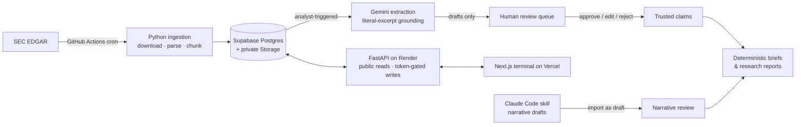
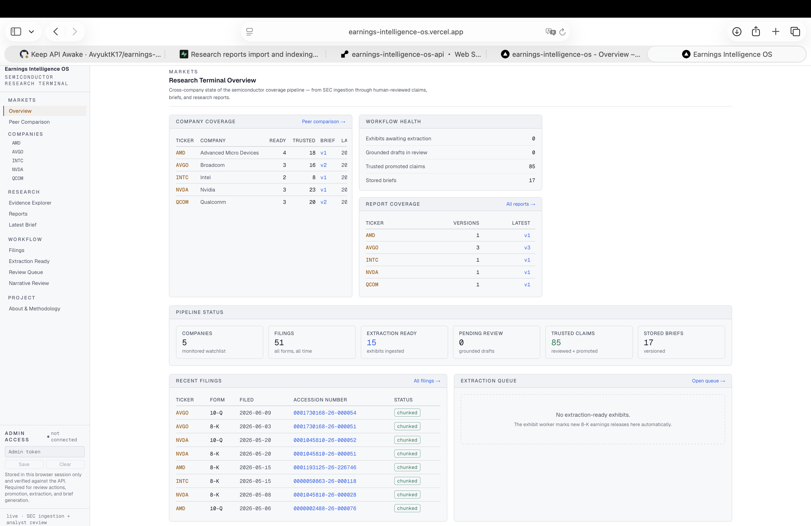
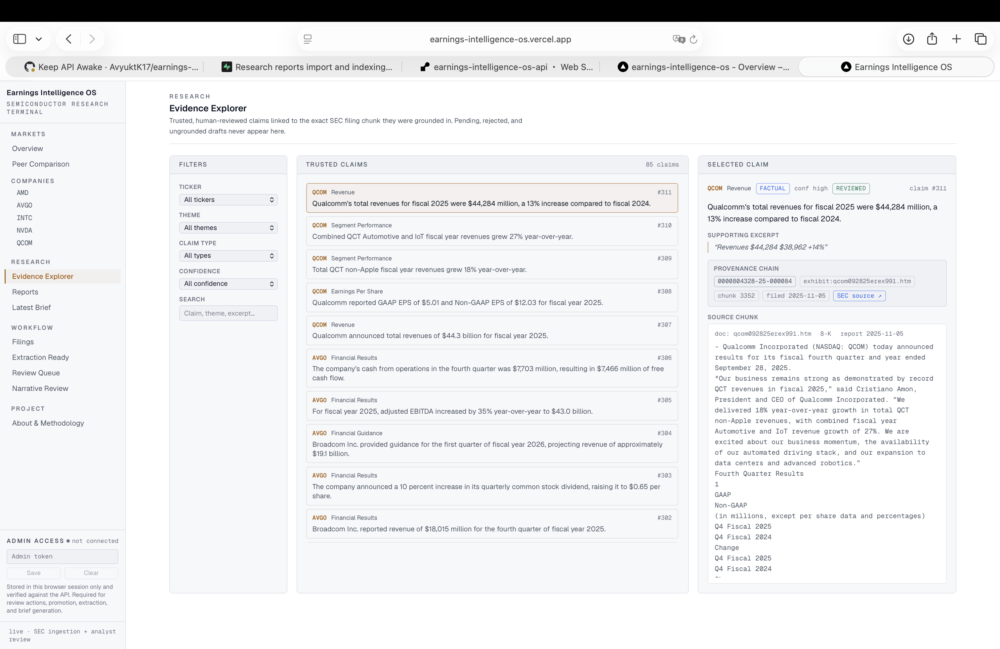
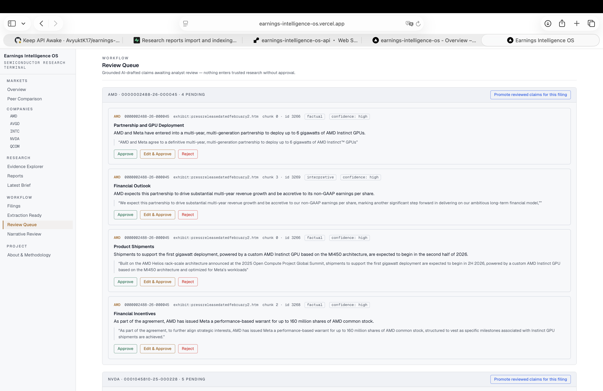
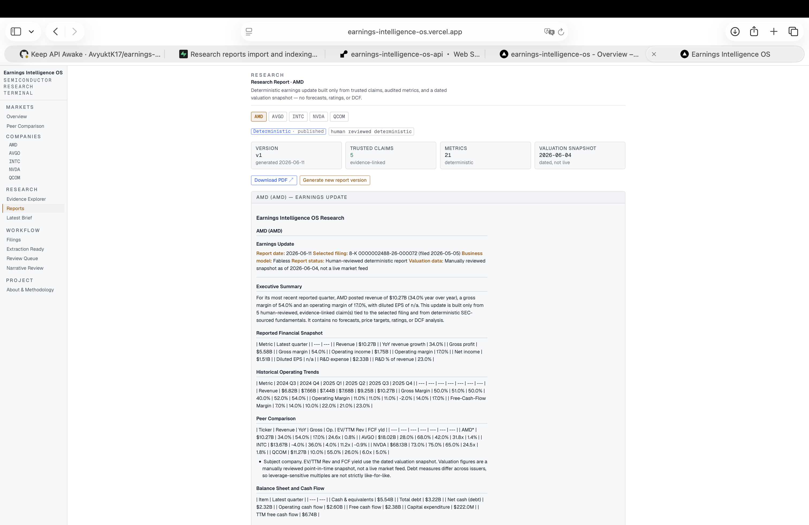

# Earnings Intelligence OS

**An evidence-grounded equity research platform for semiconductor earnings —
where AI drafts and humans approve.**

The system monitors SEC EDGAR for five semiconductor companies (NVDA, AMD,
AVGO, QCOM, INTC), ingests and chunks every new filing, and uses an LLM to
draft research claims — but every claim must literally quote its SEC source,
sit in a human review queue, and be explicitly approved before it can appear
in any published brief or research report. The result: AI-speed research with
audit-grade provenance, down to the chunk ID and SEC URL behind every sentence.

**Live:**

* 📊 Dashboard: <https://earnings-intelligence-os.vercel.app>
* 🔌 Research API: <https://earnings-intelligence-os-api.onrender.com> ([docs](https://earnings-intelligence-os-api.onrender.com/docs))
* 🧭 Methodology: <https://earnings-intelligence-os.vercel.app/about>

## Why it's built this way

LLMs read filings brilliantly and hallucinate confidently. This project treats
that as a governance problem, not a prompting problem:

* **Grounding enforced in code** — an extracted claim is rejected unless its
  supporting excerpt is a literal substring of a source-document chunk.
* **Human approval gate** — AI output is quarantined as drafts; only an
  analyst can promote a claim into the trusted layer.
* **Deterministic publishing** — briefs and reports are assembled
  arithmetically from trusted claims, audited fundamentals, and dated
  valuation snapshots. No AI in the publishing step; no forecasts, price
  targets, or ratings ever.
* **Versioned everything** — reports, briefs, and narratives are never
  overwritten; provenance (chunk IDs, packet hashes, source-report lineage)
  is preserved end to end.

## Architecture



## Screenshots

<!-- Capture from the live dashboard and drop into docs/screenshots/ -->
<!--




-->

*(Screenshots and a short demo video of the analyst workflow — extract →
review → promote → publish — are being added.)*

## Built with AI, governed like research

This project was built end to end by one person using AI development tools —
scoped and planned with ChatGPT, implemented in Claude Code pair-programming
sessions, with a custom reusable Claude Code skill
(`/semiconductor-equity-research-report`) that drafts report narratives from
exported trusted-data packets under strict guardrails (no invented forecasts,
ratings, or price targets; chunk-level citations required; output labelled as
a draft and routed through the same human review queue as everything else).
The same rule applied to building and using the product: AI accelerates,
a human owns the result.

## Repository layout

| Path | Purpose |
|------|---------|
| `src/` | Ingestion, extraction, review, promotion, and brief modules |
| `app/main.py` | FastAPI research API (read + analyst write endpoints) |
| `frontend/` | Next.js analyst dashboard (TypeScript, Tailwind) |
| `test_*.py` | Script-style tests run with `python test_<name>.py` |
| `.github/workflows/run-monitor.yml` | Scheduled filing monitor (every 6 h) |

## Backend setup

```bash
python -m venv .venv
source .venv/bin/activate      # Windows: .venv\Scripts\activate
pip install -r requirements.txt
cp .env.example .env
```

Fill in `.env`:

- `SUPABASE_URL` — your Supabase project URL
- `SUPABASE_SECRET_KEY` — your Supabase service-role key
- `SEC_USER_AGENT` — required by SEC EDGAR, e.g. `Your Name your@email.com`
- `GEMINI_API_KEY` — used only by the manual extraction scripts, never by
  the API
- `GEMINI_MODEL` — optional, defaults to `gemini-2.5-flash`
- `ALLOWED_ORIGINS` — optional, comma-separated browser origins allowed to
  call the API (defaults to `http://localhost:3000`)
- `ADMIN_API_TOKEN` — shared secret for analyst write endpoints. Generate a
  long random private value, e.g.
  `python -c "import secrets; print(secrets.token_urlsafe(48))"`, and keep
  it only in `.env` (and later in your deployment's secret settings)

> **Warning: never commit `.env` to Git.** It is listed in `.gitignore`.

### Run the API

```bash
uvicorn app.main:app --reload
```

Interactive docs at `http://localhost:8000/docs`.

### Authentication

Simple MVP admin-token design: every mutating endpoint requires the
`X-Admin-Token` request header to match the server's `ADMIN_API_TOKEN`.
Missing or wrong header → `401` with `Admin token missing or invalid.`;
if the server itself has no `ADMIN_API_TOKEN` configured, write endpoints
fail closed with a generic `500` (`Server configuration error.`). There are
no user accounts yet.

**Public (GET, no token):** `/health`, `/companies`, `/companies/{ticker}`,
`/overview`, `/filings`, `/filings/{accession_number}`,
`/briefs/latest/{ticker}`, `/review-queue`, `/extraction-ready`,
`/metrics/{ticker}`, `/peers`, `/peers/trends`, `/valuation-snapshots`,
`/evidence`, `/evidence/{claim_id}`, `/reports`, `/reports/latest/{ticker}`,
`/reports/{report_id}`, `/reports/{report_id}/pdf`.

**Protected (GET, token required):** `/admin/validate` — returns
`{"status": "ok"}` for a valid `X-Admin-Token`, 401 otherwise; the
dashboard's Admin Access panel uses it to verify a saved token without
performing any mutation.

**Protected (POST, token required):** `/review-queue/{id}/approve`,
`/review-queue/{id}/edit`, `/review-queue/{id}/reject`, `/claims/promote`,
`/briefs/generate`, `/extraction-ready/{accession_number}/extract`,
`/reports/generate`.

In the dashboard, paste the token into the **Admin Access** panel at the
bottom of the sidebar. It is kept in browser session storage only — never
in committed files and never in a `NEXT_PUBLIC_` variable. Saved tokens are
verified against `/admin/validate` and the indicator shows `connected`,
`invalid token`, or `not connected` accordingly.

`POST /claims/promote` accepts an optional JSON body
`{"ticker": "...", "accession_number": "..."}` to scope promotion to one
ticker and/or one filing; with no body it promotes every eligible reviewed
claim (the original global behavior). The dashboard always promotes scoped
to a filing.

`GET /companies` returns the monitored watchlist (ticker, company_name,
cik, business_model) ordered by ticker; the dashboard's filings filter,
sidebar Companies section, and brief tabs are populated from it.

`GET /companies/{ticker}` returns one company's research-pipeline summary:
filing counts, extraction-ready filings, trusted-claim count, latest brief
metadata, and recent filings. `GET /overview` returns cross-company totals
plus a per-company status row for the dashboard's Overview page.

`GET /extraction-ready` lists filings whose earnings-release exhibit has
been ingested and chunked — the queue for the manual AI claim-extraction
step — including each filing's claim-extraction state, pending and trusted
claim counts, and latest brief version.

### Quantitative research terminal (Bundle A)

A set of deterministic, AI-free read endpoints power the peer-comparison and
company-financials views. All figures are computed arithmetically from stored
values; unavailable inputs are returned as `null`, never fabricated.

- `GET /metrics/{ticker}` — historical quarterly operating metrics for one
  company (revenue, margins, EPS, R&D intensity, TTM series, …), with an
  optional `metric_name` filter and a latest-period summary. Valuation-derived
  rows are excluded. 404 for an unknown ticker.
- `GET /peers` — latest-period peer-comparison table across all five
  companies: operating fundamentals plus a valuation snapshot and
  deterministically computed multiples (EV/TTM revenue, EV/TTM operating
  income, price/TTM FCF, FCF yield), with comparability notes and snapshot
  dates.
- `GET /peers/trends?metric_name=&ticker=&limit=` — chart-ready time series
  for one metric across companies (optionally one ticker / last *N* periods).
- `GET /valuation-snapshots` — the manually reviewed point-in-time valuation
  snapshots for all five companies. Every row carries `is_live = false`.

**Valuation data is a manually reviewed point-in-time snapshot, not a live
market feed.** The snapshots are dated (`share_price_date`) and audited; there
is no external market-data provider wired in. Operating fundamentals were
restored from the original public semiconductor research dashboard's audited
dataset (see below) and never overwrite existing reviewed rows.

#### Audited static-data backfill

`run_static_dashboard_backfill.py` (module: `src/static_dashboard_backfill.py`)
restores audited fundamentals and valuation snapshots from a locally
downloaded copy of the original static dashboard. It is idempotent and writes
nothing without `--confirm`:

```bash
# download the public dashboard to a temp path (never committed)
curl -sL https://avyuktk17.github.io/semiconductor-research/ \
    -o /tmp/semiconductor_dashboard.html
python run_static_dashboard_backfill.py            # dry run (safe)
python run_static_dashboard_backfill.py --confirm  # insert missing rows
```

It inserts only missing AVGO `financial_metrics` operating rows (scoped to
metric names already present for the other tickers — valuation-derived and
empty-period rows are excluded) and upserts the five `valuation_snapshots`,
preserving source references, extraction methods, formulas, and manual-review
flags. Reruns insert nothing.

### Evidence Explorer & research reports (Bundle B1)

A trusted-evidence layer plus a deterministic, versioned research-report engine.
No AI is called (no Gemini, no Claude API); reports are assembled arithmetically
from three trusted sources only: promoted human-reviewed claims, deterministic
`financial_metrics`, and dated `valuation_snapshots`.

**Evidence Explorer (public reads):**

- `GET /evidence` — trusted, promoted, grounded claims with provenance
  (accession, filing date, SEC URL recovered via the source chunk). Optional
  filters: `ticker`, `accession_number`, `theme`, `claim_type`, `confidence`,
  `document_key`, `limit` (1–200). Pending proposed claims, rejected drafts,
  and ungrounded legacy rows are never exposed.
- `GET /evidence/{claim_id}` — one trusted claim with the **exact source chunk
  text**, document metadata, filing metadata, and SEC URL. `claim_id` is the
  `proposed_claim_id` (the stable key for `qualitative_claims`). 404 when missing.

**Research reports (deterministic, versioned):**

- `GET /reports` — stored report metadata (filters: `ticker`, `report_type`,
  `report_status`).
- `GET /reports/latest/{ticker}` — latest stored report (optional
  `report_type`, default `earnings_update`) with content + evidence links;
  404 when none.
- `GET /reports/{report_id}` — full report: markdown, HTML, evidence links,
  PDF Storage path.
- `GET /reports/{report_id}/pdf` — 307 redirect to a short-lived **signed**
  private-Storage URL (the bucket is never exposed directly).
- `POST /reports/generate` *(admin)* — body `{"ticker", "accession_number"?,
  "report_type"?}`; generates, renders, versions, and persists a report.

**Report structure** (deterministic): Executive Summary · Reported Financial
Snapshot · Historical Operating Trends · Peer Comparison · Balance Sheet and
Cash Flow · Valuation Snapshot · Reviewed Evidence-Linked Takeaways · Catalysts
· Risks and Watch Items · Source Appendix · Methodology and Limitations.
Catalysts/Risks are routed deterministically from human-reviewed claim text —
nothing is invented. The report **never** produces forecasts, DCF values,
price targets, or ratings, and always labels valuation as a dated snapshot.

**Versioning & Storage.** Each generation assigns the next `version_number` and
writes three artifacts to the private bucket without overwriting prior versions:

```text
reports/{ticker}/{report_type}/v{version}.md
reports/{ticker}/{report_type}/v{version}.html
reports/{ticker}/{report_type}/v{version}.pdf
```

A `research_reports` row stores the markdown/HTML inline plus the PDF path; one
`report_evidence_links` row is written per trusted claim used; and a
`report_generation_runs` row brackets each run (running → completed/failed).

**PDF export choice: `fpdf2`** (pure-Python, no system dependencies). It builds
reliably on Render, where cairo/pango-based engines (WeasyPrint, xhtml2pdf)
fail to install. Trade-off: fpdf2's core font is latin-1, so non-latin-1
punctuation in SEC excerpts is transliterated for the PDF only — the stored
Markdown and HTML keep full Unicode fidelity.

The PDF is laid out **natively from the report's intermediate block model**
(`render_report_pdf` in `src/research_report_storage.py`), not by re-parsing
HTML. The `_ResearchPDF` subclass renders an institutional research note: a
neutral branded running header (`Earnings Intelligence OS Research` + ticker /
date), section hierarchy with rules, compact financial tables with a shaded
header and zebra rows (label column left-aligned, figures right-aligned),
evidence quotes, a source appendix, and a numbered footer carrying the standard
deterministic-note disclaimer. No system dependencies are added, and there is no
copied third-party branding or wording.

```bash
python generate_research_report.py AVGO              # generate + store
python generate_research_report.py AVGO --dry-run    # print markdown, no writes
```

### Claude equity-research skill & report packets (Bundle B2.1)

A reusable Claude Code skill plus a deterministic *report-packet* exporter.
**No Claude API is called and no automatic narrative is generated** — a human
analyst runs the exporter, then invokes the skill in Claude Code to draft a
narrative locally for review.

**Report-packet exporter (`export_report_packet.py` / `src/report_packet.py`).**
Bundles every trusted, human-reviewed claim and every audited deterministic
figure for one filing into a Markdown file plus a JSON sibling under
`output/report_packets/` (gitignored). Sources only: company profile, selected
filing metadata, trusted promoted claims with source references / chunk ids /
supporting excerpts, latest + historical `financial_metrics`, the peer
comparison, the dated `valuation_snapshots`, and any existing deterministic
report's metadata. Output is deterministic (stable ordering, sorted-key JSON),
calls no LLM, writes no database rows, exposes no secrets, and labels missing
values honestly.

```bash
python export_report_packet.py --ticker AVGO --accession-number 0001730168-26-000051
# omit --accession-number to use the most recent filing with trusted claims
```

It prints the markdown and JSON paths plus counts (trusted claims, metrics,
evidence links) and the valuation snapshot date.

**Skill (`.claude/skills/semiconductor-equity-research-report/`).** Invoke in
Claude Code as `/semiconductor-equity-research-report` and provide the generated
markdown packet path. The skill (`SKILL.md` + `template.md` +
`quality-checklist.md`, the latter two loaded only when the skill runs so
routine sessions stay token-efficient) drafts a professional earnings-update
narrative — Front-page Executive Summary · Quarterly Results · Guidance and
Outlook · Historical Trends · Peer Comparison · Balance Sheet and FCF ·
Valuation Snapshot · Catalysts · Risks and Watch Items · Evidence Appendix ·
Methodology — **only** from the supplied packet. Guardrails: never invent a
rating, target price, forecast, DCF, or consensus estimate; always label
valuation as a dated, manually reviewed snapshot; distinguish reported facts
from interpretation; cite source references and chunk ids; preserve missing
values; label the output `Claude-assisted draft for analyst review`; and never
write to trusted tables. The result is a **local draft only** — not uploaded,
not persisted to Supabase.

**Analyst workflow:**

```bash
python export_report_packet.py --ticker AVGO --accession-number 0001730168-26-000051
```

then, in Claude Code:

```text
/semiconductor-equity-research-report
```

and provide the printed markdown packet path. The skill produces a local
`Claude-assisted draft for analyst review`; review it before any downstream use.

### Claude-assisted narrative review workflow (Bundle B2.2)

Imports the locally drafted narrative as a **private draft report**, then gives
analysts approve / edit-and-approve / reject controls. **Claude generation stays
manual and local — the backend never calls the Claude API or Gemini**, and no
narrative is generated automatically.

**End-to-end analyst workflow:**

```bash
# 1. Export the deterministic packet
python export_report_packet.py --ticker AVGO --accession-number 0001730168-26-000051
# 2. In Claude Code: /semiconductor-equity-research-report  (drafts a local .md)
# 3. Import the local draft (dry run by default; --confirm to write)
python import_claude_narrative.py \
  --ticker AVGO \
  --accession-number 0001730168-26-000051 \
  --markdown-path output/narratives/avgo_0001730168_26_000051_claude_draft.md \
  --packet-path output/report_packets/avgo_0001730168_26_000051_packet.md \
  --source-report-id 1 \
  --confirm
# 4. Review in the dashboard's "Narrative Review" page (approve / edit / reject)
```

**Import service (`src/claude_narrative_import.py`).** Validates that the draft
carries the exact `Claude-assisted draft for analyst review` label and is not
empty/incomplete, computes the packet's SHA-256 for provenance, and inserts one
`research_reports` row with `report_status = "draft"`,
`generator_type = "claude_assisted"`, `imported_at`, `source_report_id`, and
`source_packet_hash`. Evidence links are reused from the deterministic source
report when given, else derived from the filing's trusted promoted claims. A
completed `report_generation_runs` audit row is written. No trusted-claim
mutation, no overwrite (always a new version). Version numbers share one
sequence per `(ticker, report_type)` — the table's unique constraint is
`(ticker, report_type, version_number)`, so deterministic and Claude-assisted
versions are numbered together.

**Review service (`src/research_report_review.py`).** Acts only on
`claude_assisted` `draft` reports:

- `approve_research_report` — draft → reviewed (in place);
- `edit_and_approve_research_report` — preserves the original draft immutably as
  `superseded` and creates a **new** `reviewed` version with the edited markdown
  plus copied provenance and evidence links;
- `reject_research_report` — draft → rejected with a required reason.

Deterministic reports can never be driven through this workflow.

**API endpoints** (all admin-protected via `X-Admin-Token`):

- `GET /reports/review-queue` — Claude-assisted drafts only (with markdown +
  evidence-link count);
- `POST /reports/import-claude-draft` — validates the label and inserts a draft;
- `POST /reports/{report_id}/approve`;
- `POST /reports/{report_id}/edit-and-approve`;
- `POST /reports/{report_id}/reject`.

Missing/invalid token → 401, unknown report → 404, invalid state transition →
400; error bodies never expose secrets or stack traces.

**Draft / public visibility rules.** Public report endpoints (`/reports`,
`/reports/latest/{ticker}`, `/reports/{id}`) exclude `draft`, `rejected`,
`superseded`, and `failed` reports. They show deterministic reports
(`human_reviewed_deterministic`) and reviewed Claude-assisted reports only.
`/reports/latest/{ticker}` defaults to the most recent *visible* report. The
admin **Narrative Review** page (`/reports/review`) is the only surface that
exposes Claude-assisted drafts, and only with a saved admin token.

**Frontend.** A new sidebar link, **Narrative Review** (`/reports/review`),
shows draft queue cards (ticker, accession, version, imported timestamp, source
report id, claim/evidence counts, packet-hash preview, rendered markdown
preview) with Approve / Edit-and-Approve / Reject / Skip actions, reviewer-notes
and rejection-reason fields, refresh-after-action, and clean empty/error states.
The token never leaves browser session storage. Report list and viewer pages now
label each report **Deterministic** vs **Claude-assisted (reviewed)**.

### Manual claim extraction (admin-triggered)

`POST /extraction-ready/{accession_number}/extract` (optional body
`{"max_claims": 1–10}`, default 5) runs grounded Gemini extraction on the
filing's processed earnings exhibit. It is the **only** route that calls
Gemini, and only when an admin triggers it from the dashboard or CLI —
extraction is never scheduled, keeping free-tier quota under analyst
control. Quota and rate-limit failures return `429` (no drafts are ever
deleted by a failed run); other provider failures return a safe `500` and
the error is recorded on the filing.

Filing-level extraction lifecycle (`claim_extraction_status`):

- `not_started` — no extraction run yet
- `pending_review` — drafts stored and awaiting analyst review
- `approved` — every grounded draft reviewed and promotion completed
  (set automatically when a promotion run leaves no grounded pending rows;
  once the Review Queue empties for a filing, the terminal promotion is
  triggered from the Extraction Ready page)
- `failed` — last run errored; the message is stored in
  `claim_extraction_error`

Exhibit selection ranks document quality first — press releases beat
financial-results pages, which beat bare EX-99.1 markers, which beat slide
decks — and file size only breaks ties within a tier.

### Automated exhibit ingestion

A scheduled worker (`run_exhibit_processor.py`, also a GitHub Actions step)
checks up to 3 chunked 8-K filings per run for an earnings-release exhibit
(EX-99.1 style), downloads/parses/uploads it, chunks it, and records the
outcome on the filing row. The exhibit status lifecycle is:

- `not_checked` — default; the worker has not inspected the filing yet
- `processed` — exhibit ingested and chunked; `earnings_release_document_id`
  points at the `filing_documents` row
- `not_found` — the 8-K has no likely earnings-release exhibit (never
  rechecked automatically)
- `failed` — last attempt errored; the error is stored and the filing is
  retried only with `process_pending_exhibits(include_failed=True)`

Gemini claim extraction remains a deliberate manual step (free-quota
control and analyst oversight) — the worker and the deployed API never
call AI.

### CLI utilities

```bash
python run_monitor.py            # check EDGAR for new filings
python run_exhibit_processor.py  # ingest earnings-release exhibits (max 3)
python run_static_dashboard_backfill.py  # restore audited metrics + valuations
                                 # (dry run; writes need --confirm)
python generate_research_report.py AVGO  # deterministic report (--dry-run to preview)
python list_filings.py           # list stored filings
python review_claims.py          # interactive claim review
python promote_claims.py         # promote reviewed claims
python cleanup_legacy_claims.py  # list legacy ungrounded pending drafts
                                 # (dry run; deletion needs --confirm)
```

## Frontend setup

```bash
cd frontend
npm install
cp .env.example .env.local   # sets NEXT_PUBLIC_API_BASE_URL=http://localhost:8000
npm run dev
```

Open `http://localhost:3000` (start the backend first). The browser talks
only to the FastAPI service — never directly to Supabase.

### Design system (Bundle C1)

The dashboard uses an institutional research-terminal aesthetic: a dense, dark
theme with restrained accents, subtle borders, compact spacing, consistent
metric formatting, and minimal animation. Shared design-system components live
in `frontend/src/components/`:

- `ResearchHeader` — page masthead (eyebrow / title / description / actions)
- `MetricCard` — compact KPI cell with tabular figures and tone colors
- `SectionHeader` — labelled section divider with count + actions
- `StatusPill` — one canonical status→color mapping (filing / extraction /
  report lifecycles); `StatusBadge` delegates to it
- `DataTable` (+ `THead`/`TH`/`TR`/`TD`) — dense tables with responsive
  horizontal overflow and a `minWidth` for wide financial tables
- `EmptyState`, `LoadingSkeleton`, `ColdStartNotice` — honest loading/empty
  states; the cold-start banner explains the Render free-tier wake-up delay
- `SourceBadge`, `ReportTypeBadge` — prominent provenance and
  deterministic-vs-Claude-assisted labelling
- `TickerTabs` — shared per-company tab strip (reports + briefs)
- `ChartPanel` — chart container with title, control slot, and caption

Design tokens live in `globals.css` (surfaces, edges, status colors including
`warning`, page max-width, skeleton shimmer, focus-visible outlines). Shared
hooks (`src/lib/hooks.ts`) consolidate the companies list and admin-token reads.

Navigation is grouped into **Markets** (Overview, Peer Comparison, Companies),
**Research** (Evidence Explorer, Reports, Latest Brief), and **Workflow**
(Filings, Extraction Ready, Review Queue, Narrative Review), with explicit
active-state matching and a responsive sidebar that stacks on mobile. The admin
token still lives only in browser session storage.

Cold-start UX: a slow request (the Render dyno waking from sleep) raises a
non-blocking banner via the API client's in-flight tracker, so the first call of
a session no longer looks like a hang.

### Dashboard routes

| Route | Purpose |
|-------|---------|
| `/` | Cross-company overview: totals, market leaders, peer-fundamentals table, per-company status, latest filings |
| `/peers` | Peer-comparison terminal: ranked bar chart, full fundamentals + valuation table, comparability notes (charts via `recharts`) |
| `/companies/[ticker]` | Company deep dive with **Overview / Financials / Filings / Evidence / Reports** tabs: KPI cards, trend charts, balance-sheet & valuation snapshot, trusted-claim summary, latest report/brief links, and the pipeline view |
| `/evidence` | Evidence Explorer: ticker/theme/type/confidence filters + text search; compact cards with a prominent source-provenance row (`SourceBadge`) and expandable exact source-chunk text. Accepts a `?ticker=` deep link |
| `/reports` | Research-report index: ticker/type filters, report-type badges (deterministic vs Claude-assisted), status/version, claim & metric counts, PDF links |
| `/reports/latest/[ticker]` | Latest report: ticker tabs, report-type/status badges, source-report lineage, rendered report, version selector, PDF download (shown only when a PDF exists), evidence links, admin-only generate |
| `/filings` | Filing feed with ticker/status/limit filters |
| `/filings/[accessionNumber]` | Filing detail, documents, chunk count |
| `/extraction-ready` | Exhibit queue with a lifecycle trail (not_started › pending_review › approved), Extract Claims, terminal Promote reviewed claims, first-brief generation, and View latest brief links |
| `/review-queue` | Approve / edit / reject grounded pending claims; scoped promotion |
| `/briefs/latest/[ticker]` | Latest stored brief with company tabs (from `/companies`), markdown rendering, and version generation |

## Deployment (live)

The MVP is deployed:

* **Backend:** Render web service at
  `https://earnings-intelligence-os-api.onrender.com`, built from the
  `render.yaml` blueprint with start command:

  ```bash
  uvicorn app.main:app --host 0.0.0.0 --port ${PORT:-8000}
  ```

* **Frontend:** Vercel at `https://earnings-intelligence-os.vercel.app`,
  with `NEXT_PUBLIC_API_BASE_URL` set to the Render API origin.

Backend environment variables (configured in Render): `SUPABASE_URL`,
`SUPABASE_SECRET_KEY`, `SEC_USER_AGENT`, `GEMINI_API_KEY`, `GEMINI_MODEL`
(optional), `ALLOWED_ORIGINS`, and `ADMIN_API_TOKEN`. `ALLOWED_ORIGINS` is
set to `http://localhost:3000,https://earnings-intelligence-os.vercel.app`
so both local development and the deployed dashboard can call the API. The
Supabase server-side key configuration in Render was corrected after the
initial deploy.

A production smoke test confirmed the public GET endpoints and the
admin-token-protected POST endpoints work against the live deployment.
Notes: Gemini extraction remains a manual local step — the deployed API
never calls Gemini — and scheduled SEC ingestion stays in GitHub Actions.

## Tests

```bash
python test_api_health.py          # and the other test_api_*.py scripts
cd frontend && npm run lint && npm run build
```

API tests run against live Supabase data; mutation tests use temporary rows
and clean up after themselves, supplying a temporary admin token through the
environment (never printed). The quantitative endpoints are covered by
`test_api_metrics.py`, `test_api_peers.py`, and
`test_api_valuation_snapshots.py`; the backfill parser/idempotency logic is
covered offline by `test_static_dashboard_backfill.py`. The deterministic
report-packet exporter is covered by `test_report_packet.py` (trusted-claims-only,
grounding, determinism across reruns, and honest missing-data labelling; writes
to a temp dir and never calls an LLM). The Claude-assisted narrative workflow is
covered by `test_claude_narrative_import.py` (validation, dry-run safety,
versioning), `test_research_report_review.py` (approve / edit-and-approve /
reject, invalid transitions, deterministic protection), and
`test_api_report_review.py` (auth, drafts-only queue, public draft exclusion,
404/400, no secret leakage). These create clearly-marked temporary draft rows
and delete them (with evidence links and audit runs) in `finally` blocks; no
trusted claims or deterministic reports are touched, and no Claude/Gemini call
is ever made.

## Roadmap

- **Bundle A — Quantitative research terminal (complete):** audited metrics
  + valuation backfill, `/metrics`, `/peers`, `/peers/trends`,
  `/valuation-snapshots`, the `/peers` page, charted company deep dives, and a
  fundamentals-driven overview.
- **Bundle B1 — Evidence Explorer & report engine (complete):** a trusted-
  evidence explorer, a deterministic professional earnings-update report engine
  with versioning, Storage persistence (Markdown/HTML/PDF), and report viewing
  pages. Limitations: no live valuation feed, no forecasts, no DCF, no target
  price, no rating, and no automatic Claude/Gemini usage.
- **Bundle B2.1 — Claude equity-research skill & report packets (complete):**
  a reusable `/semiconductor-equity-research-report` Claude Code skill plus a
  deterministic `export_report_packet.py` exporter. The analyst exports a
  trusted-data packet, then invokes the skill in Claude Code to draft a local
  `Claude-assisted draft for analyst review`. No Claude API calls, no automatic
  narrative generation, no database writes; guardrails forbid invented ratings,
  target prices, forecasts, DCF, and consensus estimates.
- **Bundle B2.2 — Claude-assisted narrative review workflow (complete):**
  imports locally drafted narratives as private draft reports and adds analyst
  approve / edit-and-approve / reject controls plus a Narrative Review page.
  Claude generation stays manual and local; the backend never calls the Claude
  API or Gemini, and drafts are never published until approved.
- **Bundle C1 — institutional UI redesign and report-layout polish
  (complete):** a shared design-system component library (`ResearchHeader`,
  `MetricCard`, `SectionHeader`, `StatusPill`, `DataTable`, `EmptyState`,
  `LoadingSkeleton`, `ColdStartNotice`, `SourceBadge`, `ReportTypeBadge`,
  `TickerTabs`, `ChartPanel`) with consolidated design tokens; grouped
  Markets / Research / Workflow navigation; redesigned Overview, Peer
  Comparison (sortable table), tabbed company deep dives, Evidence Explorer
  (prominent provenance), Reports, and workflow pages; loading skeletons,
  empty states, a Render cold-start notice, responsive table overflow, and a
  mobile sidebar fallback; and an institutional, block-rendered deterministic
  PDF (branded header, page numbers, shaded financial tables, source appendix,
  disclaimer footer) with no new system dependencies. No backend logic, API
  contracts, secrets, data, or LLM usage changed.
- **Bundle C2 — v0 institutional terminal redesign, Phase B (complete):**
  ported the v0 dark-terminal visual language across the remaining workflow and
  report pages (`/filings`, `/filings/[accessionNumber]`, `/extraction-ready`,
  `/review-queue`, `/briefs/latest/[ticker]`, `/reports`,
  `/reports/latest/[ticker]`, `/reports/review`); converted the oversized
  Extraction Ready cards into a dense action table (preserving the Extract /
  Promote / Generate-brief / View-brief protected actions) and regrouped the
  Reports library by ticker (latest prominent, prior versions collapsible).
  Added an **OS-driven light/dark theme**: `globals.css` defines a light-default
  token set with a `@media (prefers-color-scheme: dark)` override (no manual
  theme switcher), components reference only semantic tokens (no hard-coded
  white/black), and the recharts components read the live tokens so charts,
  tables, pills, panels, skeletons, empty states, and the cold-start notice
  work in both themes with safe contrast. Refined the deterministic `fpdf2` PDF
  renderer (masthead eyebrow + dominant company title, accent-tinted metadata
  panel, accent section ticks and evidence-quote rules) while keeping built-in
  fonts, pure-Python deployability, private Storage, and signed download URLs.
  No backend logic, API contracts, Supabase schema, secrets, GitHub Actions, or
  LLM usage changed; the only Python touched is the PDF rendering path.
- **Bundle C (remaining) — final QA:** portfolio screenshots and demo video
  (deferred), plus end-to-end production verification.
